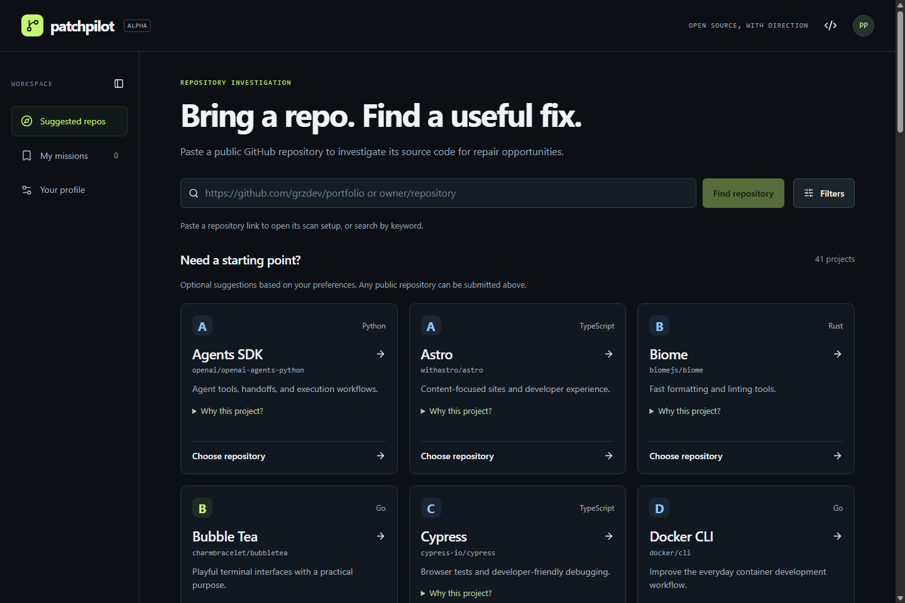
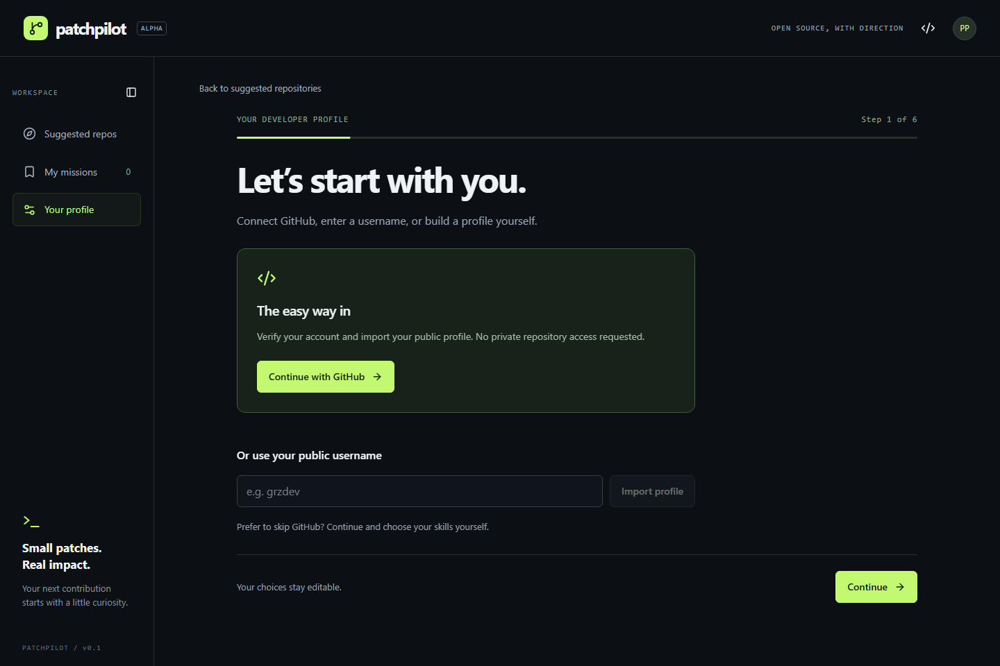
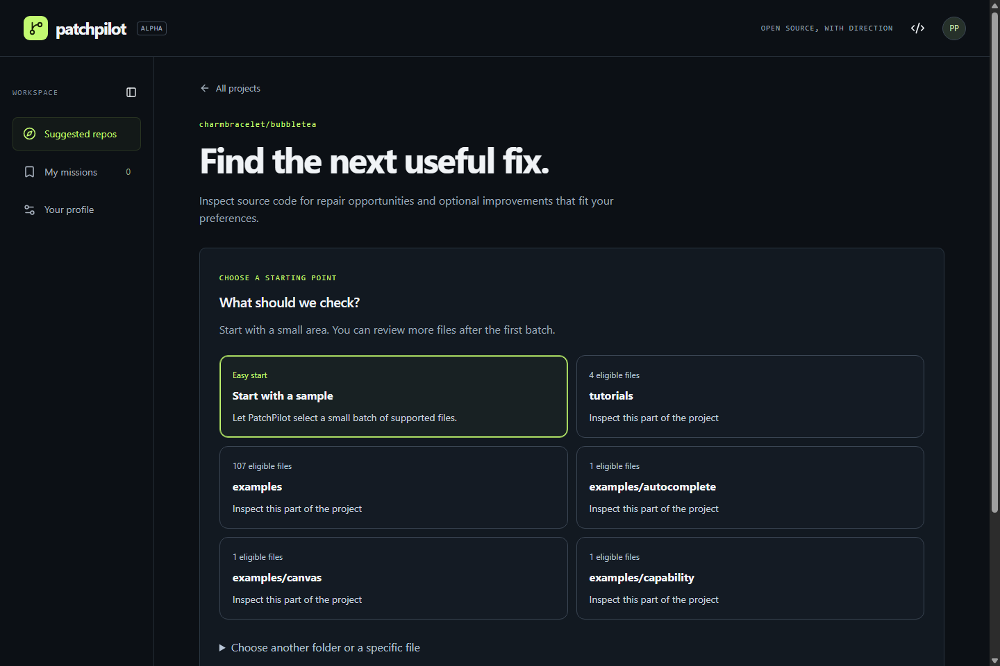

# 🧭 PatchPilot

> **Find your next open-source mission, investigate source code with verifiable evidence, and prepare high-impact pull requests.**

[](https://patchpiilot.netlify.app/)
[](https://drive.google.com/file/d/1OlccgJn44maRAvb5Gq9dyJnN43aesBPh/view?usp=sharing)

[](tests)
[](https://nodejs.org)
[](https://nextjs.org)
[](https://groq.com)

---

> 🚀 **Live Site:** [https://patchpiilot.netlify.app/](https://patchpiilot.netlify.app/)  
> 🎬 **Demo Video:** [Watch on Google Drive](https://drive.google.com/file/d/1OlccgJn44maRAvb5Gq9dyJnN43aesBPh/view?usp=sharing)

---

## 🎯 What is PatchPilot?

Contributing to open source can be frustrating and overwhelming. Developers often face:
* **The "Empty Search Box" Problem**: Endless repositories with no clear idea of where to start or which projects fit their current skillset.
* **Stale or Competing Issues**: Spending hours investigating an issue only to find it was already solved in a closed PR, assigned to an inactive contributor, or impossible to reproduce.
* **Context Overload**: Large codebases with dozens of directories, ambiguous documentation, and no clear entry point for making a targeted fix.
* **AI Hallucinations**: Generic AI code reviews suggesting bug fixes for code that doesn't actually exist or failing to cite exact line numbers.

**PatchPilot solves this.** It acts as an intelligent mission control that bridges the gap between discovery and shipping a verified contribution. It pairs profile matching and heuristic issue screening with streaming AI source-code analysis, citation verification, and duplicate checks.

---

## 📸 Interface & Workflow

### 1. Repository Discovery & Recommendations
Explore curated projects across ecosystems (Developer Tools, Frontend, AI/ML, Systems, CLI) or paste any public GitHub repository to investigate immediately. Filter by language, ecosystem, or personal profile match.



---

### 2. Personalized Developer Onboarding
Connect with GitHub or enter a public username to import language signals, or customize your profile manually. Select preferred work types (Bug fixes, UX polish, quick wins, deep dives) and available time budget.



---

### 3. Targeted Source-Code Investigation & Scanner
Inspect specific folders, sub-packages, or small file samples. PatchPilot extracts real repository files at pinned commits, evaluates code behavior with Groq, strictly validates exact source citations, checks for existing PRs/issues, and compiles ready-to-use PR drafts and AI coding prompts.



---

## ✨ Key Features

* **🛡️ Zero-Hallucination Citation Verification**: Every candidate finding generated by AI is rigorously matched against exact source code lines in the repository. Fabricated citations and phantom issues are immediately rejected.
* **⚡ High-Speed Groq AI Analysis**: Powered by Groq (`openai/gpt-oss-120b`) for near-instantaneous code review, with automatic fallback to OpenRouter (`openrouter/free`) if quota limits or transient network errors occur.
* **🔍 Duplicate & Prior-Work Detection**: Searches live GitHub issues and PRs for keywords related to each finding to warn you before starting redundant work.
* **📚 Anakin.io Documentation Research**: Queries Anakin.io Agentic Search to locate official documentation and reference material relevant to the detected code behavior.
* **📋 Deterministic PR Drafts & Agent Briefs**: Every finding produces a ready-to-use PR title and description, as well as a complete investigation prompt formatted for Codex, Cursor, Claude, or Copilot.
* **🔐 Privacy-First GitHub Authentication**: Uses GitHub OAuth with PKCE and HMAC-signed session cookies (24h expiry). Requests zero repository write permissions.

---

## 🏗️ Architecture & Tech Stack

```
patchpilot/
├── docs/screenshots/       # High-resolution application previews
└── web/
    ├── app/                # Next.js / Vinext application routes & API endpoints
    │   ├── api/auth/       # GitHub OAuth sign-in, session, and disconnect
    │   ├── api/github/     # GitHub API proxy, repo inspection, folder tree
    │   └── api/scan/       # Server-Sent Events (SSE) streaming code scan
    ├── components/         # Modular UI components (Discovery, Onboarding, Scanner)
    ├── lib/                # Core domain logic
    │   ├── catalog.ts      # Curated repository catalog & profile ranking
    │   ├── github.ts       # GitHub REST client with in-memory caching & rate limiting
    │   ├── oauth.ts        # PKCE authentication & signed session state
    │   ├── reviewers.ts    # Groq & OpenRouter AI reviewer integrations
    │   ├── scanner.ts      # Source file extraction, batching, and evaluation
    │   └── scan-validation.ts # Strict citation & schema validation
    └── tests/              # Comprehensive test suite (40 automated tests)
```

* **Frontend**: React 19, Next.js / Vinext, Tailwind CSS, Lucide icons, Radix UI primitives.
* **AI Providers**: Groq API (`openai/gpt-oss-120b`), OpenRouter API (`openrouter/free`), Anakin.io Search API.
* **Data & State**: GitHub REST API v3, LocalStorage (offline saved missions), HMAC-signed cookies.

---

## 🚀 Quick Start (Local Development)

### Prerequisites
* **Node.js**: `v22.13.0` or later (`v24` recommended)
* **npm**: `v10+`

### Setup

1. **Clone the repository**:
   ```sh
   git clone https://github.com/grzdev/patchpilot.git
   cd patchpilot/web
   ```

2. **Install dependencies**:
   ```sh
   npm run install:ci
   ```

3. **Configure Environment Variables**:
   Create a `.env.local` file in `web/` (do not commit this file):
   ```dotenv
   # Required for code scanning
   GROQ_API_KEY=your_groq_api_key

   # Required for GitHub Sign-In
   GITHUB_CLIENT_ID=your_oauth_app_client_id
   GITHUB_CLIENT_SECRET=your_oauth_app_client_secret
   AUTH_SESSION_SECRET=a_random_secret_at_least_32_chars_long
   GITHUB_CALLBACK_URL=http://localhost:5173/api/auth/github/callback

   # Optional / Recommended
   GITHUB_TOKEN=your_personal_github_token
   ANAKIN_API_KEY=your_anakin_api_key
   OPENROUTER_API_KEY=your_openrouter_api_key
   ```

4. **Start the development server**:
   ```sh
   npm run dev
   ```
   Open [http://localhost:5173](http://localhost:5173) in your browser.

5. **Run the test suite**:
   ```sh
   npm test
   ```
   *Runs 40 automated tests covering ranking, screening, caching, OAuth, and scanner validation.*

---

## 🌐 Netlify Deployment Guide

When deploying to Netlify, configure the build settings and environment variables in the Netlify Dashboard:

### Build Settings
* **Base directory**: `web`
* **Build command**: `npm run build`
* **Publish directory**: `web/dist/client` (or configured output directory)

### Required Environment Variables (Netlify Site Settings)
Add these under **Site configuration > Environment variables**:

| Variable | Required | Description |
| :--- | :---: | :--- |
| `GROQ_API_KEY` | **Yes** | API key for Groq code reviews (`openai/gpt-oss-120b`). |
| `GITHUB_CLIENT_ID` | **Yes** | Client ID of your GitHub OAuth App. |
| `GITHUB_CLIENT_SECRET` | **Yes** | Client Secret of your GitHub OAuth App. |
| `AUTH_SESSION_SECRET` | **Yes** | Secret string (min 32 characters) for signing session cookies. |
| `GITHUB_CALLBACK_URL` | **Yes** | `https://<your-site>.netlify.app/api/auth/github/callback` |
| `GITHUB_TOKEN` | *Recommended* | Personal GitHub token to prevent rate-limiting on public API requests. |
| `ANAKIN_API_KEY` | *Optional* | Anakin.io search key for documentation references. |
| `OPENROUTER_API_KEY` | *Optional* | Fallback provider when Groq rate limits are encountered. |

> [!NOTE]
> Ensure your GitHub OAuth App's **Authorization callback URL** in GitHub Developer Settings matches your live Netlify URL (`https://<your-site>.netlify.app/api/auth/github/callback`).

---

## 📜 License

MIT License.
